# Customer Journey — Teos Platform

**Status:** Draft for validation  
**Audience:** Product, sales, customer success, implementation partners  
**Related:** [business-description.md](./business-description.md)

---

## Overview

This document describes the end-to-end journey for a Teos customer — from first install through daily operations. The journey applies to **both large enterprises and SMEs**; steps are the same, but enterprise deployments typically add approval gates, multi-site rollout, and IT/OT change windows.

**Primary persona:** Plant engineer or OT lead (not a cloud architect or data scientist)  
**Goal:** Go from bare infrastructure to live AI on operational data — entirely on the customer’s premises.

```
Install → Onboard → Connect data → Download & run models → Operate & chat with data
```

---

## Journey at a Glance

| Phase | Customer outcome | Teos surface |
|-------|------------------|--------------|
| 1. Install | Teos platform running on customer hardware | Installer / appliance / container |
| 2. Onboard | Licensed site, admin user, baseline health | Management Portal — first-run wizard |
| 3. Configure data connections | Live tags/streams from PLCs and sensors | Management Portal — Connect |
| 4. Download AI models | Models available in local registry | Management Portal — Model Catalog |
| 5. Run models locally | Inference and agents active on-prem | Management Portal — Deploy & Runtime |
| 6. Chat with data | Operators query plant state in natural language | Operations Copilot |

---

## Phase 1 — Install

**Who:** IT/OT engineer or Teos partner on site  
**Duration:** Hours (SME) to days (enterprise, change control)  
**Prerequisite:** Hardware meets spec; network access to plant floor segment (if applicable)

### Steps

1. **Choose deployment form**
   - **Software-only** — install on customer server, VM, or industrial PC
   - **Appliance** — rack or edge box pre-imaged with Teos (optional)

2. **Run the installer**
   - Obtain install package (online download or offline bundle for air-gapped sites)
   - Execute install script or appliance first-boot wizard
   - Confirm core services start: Connect, Understand, Act, Manage

3. **Verify network placement**
   - Management Portal reachable from operator/engineering VLAN
   - Connect layer can reach OT devices (Modbus, MQTT, OPC-UA, Profinet, S7, CAN, etc.)
   - Outbound internet **optional** — only needed for license validation and model catalog sync; air-gapped mode supported via offline packages

4. **Health check**
   - Open local health endpoint or Portal dashboard
   - All services green; disk and GPU/NPU detected if AI acceleration is required

### Success criteria

- Platform reachable at local URL (e.g. `https://teos.local` or site-specific hostname)
- Install log archived; no failed dependencies
- Customer owns backup/snapshot of VM or appliance config

### Common friction

| Issue | Mitigation |
|-------|------------|
| Air-gapped site | Offline install bundle + offline license file |
| Firewall blocks OT protocols | Pre-install network checklist with IT/OT |
| Undersized hardware | Minimum spec validator in installer |

---

## Phase 2 — Onboard

**Who:** Site admin (customer) + optional Teos CS/partner  
**Duration:** 30–60 minutes (SME) to 1–2 sessions (enterprise)  
**Prerequisite:** Phase 1 complete

### Steps

1. **First login — Management Portal**
   - Admin opens Portal in browser (HTTPS, on-prem)
   - Complete first-run wizard: site name, timezone, language

2. **Activate license**
   - Enter subscription key or upload license file
   - Select tier (nodes/sites, use-case entitlements)
   - Confirm entitlement: Connect limits, model catalog access, copilot enabled

3. **Create users and roles**
   - **Admin** — install, license, connections, model deploy
   - **Engineer** — configure tags, agents, thresholds
   - **Operator** — monitor, acknowledge alerts, use Operations Copilot (read-focused)

4. **Optional: register with Teos (connected sites only)**
   - Sync license and catalog metadata
   - No operational data leaves the site

5. **Baseline tour**
   - Portal home: system health, connected assets (empty), model inventory (empty)
   - Guided checklist: *Connect data → Get models → Deploy → Chat*

### Success criteria

- At least one admin and one operator account active
- License valid; entitlements visible in Portal
- Onboarding checklist visible on Portal home

### Portal areas introduced

| Area | Purpose |
|------|---------|
| **Home / Dashboard** | Health, onboarding progress, quick actions |
| **Settings** | Site, users, license, integrations |
| **Help** | Docs, support contact, export diagnostics bundle |

---

## Phase 3 — Configure Data Connections

**Who:** Plant engineer / OT integrator  
**Duration:** Hours to days depending on plant complexity  
**Prerequisite:** Phase 2 complete; OT network paths verified  
**Platform layer:** **Connect** (+ **Understand** auto-contextualization)

### Steps

1. **Open Connect in Management Portal**
   - Navigate to **Connect → Data Sources → Add connection**

2. **Select protocol and device profile**
   - Choose protocol: Modbus TCP/RTU, MQTT, OPC-UA, Profinet, S7, CAN bus, etc.
   - Pick vendor template where available (Siemens, Allen-Bradley, ABB, Schneider, Mitsubishi, Beckhoff, generic)

3. **Configure endpoint**
   - IP/host, port, credentials, poll rate or subscription mode
   - Security: certificates for OPC-UA, VPN/tunnel if cross-segment

4. **Discover and map tags**
   - **Auto-discover** — scan address space or browse OPC-UA nodes
   - **Manual map** — import CSV/tag list or map registers manually
   - Assign human-readable names, units, and asset hierarchy (line → machine → sensor)

5. **Test connection**
   - Live preview of sample values in Portal
   - Fix connectivity or mapping errors before saving

6. **Contextualize (Understand)**
   - Platform builds AI-ready model: assets, relationships, normal ranges
   - Engineer reviews auto-generated asset tree; adjusts labels and groupings

7. **Enable streaming to runtime**
   - Mark connection *Active* — data flows to local store and inference pipeline
   - Set retention policy (local only; no cloud egress)

### Success criteria

- One or more connections *Healthy* with stable tag counts
- Asset tree reflects physical layout sufficiently for operators
- Sample queries return live values in Portal

### Common friction

| Issue | Mitigation |
|-------|------------|
| Legacy PLC, non-standard map | Vendor templates + manual override |
| Too many tags | Start with pilot line; expand incrementally |
| Naming chaos | Guided rename + asset hierarchy wizard |

---

## Phase 4 — Download AI Models (Management Portal)

**Who:** Engineer or admin  
**Duration:** Minutes to hours (large models, slow link)  
**Prerequisite:** License includes desired use cases; catalog access or offline bundle  
**Platform layer:** **Manage** (model registry)

### Steps

1. **Open Model Catalog**
   - Portal → **AI Models → Catalog**
   - Browse by use case: predictive maintenance, anomaly detection, quality, energy, operations copilot SLM, etc.

2. **Review model card**
   - Required inputs (tags/signals), hardware (CPU/GPU/NPU), latency profile
   - Version, release notes, compatibility with connected protocols/assets

3. **Download to local registry**
   - **Online:** Download pulls artifact to on-prem registry (encrypted at rest)
   - **Air-gapped:** Import `.teosmodel` bundle or USB transfer from Teos/partner
   - Progress shown in Portal; checksum verified on completion

4. **Confirm local inventory**
   - Portal → **AI Models → Installed**
   - Model status: *Downloaded*, not yet *Running*

### Success criteria

- Target model(s) appear in **Installed** with valid signature and version
- Disk space and runtime requirements met
- No outbound data during download (weights stay on-prem)

### Notes

- Catalog sync can be scheduled or manual
- Enterprise may require change approval before new model versions
- SMEs often start with one bundled use-case package

---

## Phase 5 — Run Models Locally

**Who:** Engineer (deploy), operator (monitor)  
**Duration:** Minutes per model after data is connected  
**Prerequisite:** Phase 3 + 4 complete  
**Platform layer:** **Act** (+ **Manage** runtime controls)

### Steps

1. **Create deployment**
   - Portal → **AI Models → Installed → Deploy**
   - Select model version and target scope (site, line, asset group)

2. **Bind inputs**
   - Map model inputs to live tags from Connect
   - Portal validates types, units, and minimum data history where required
   - Optional: warm-up period for baseline learning

3. **Configure runtime**
   - Inference interval or event-driven triggers
   - Alert thresholds, recommended actions, human-in-the-loop gates for control actions
   - Resource limits (CPU/GPU shares) on shared edge hardware

4. **Start local runtime**
   - Deploy starts on-prem inference worker — no cloud round-trip
   - Status transitions: *Starting → Running*
   - Latency and throughput visible on runtime dashboard

5. **Validate in production**
   - Shadow mode (alerts only) vs. active mode (recommendations or closed-loop with approval)
   - Compare outputs against operator judgment for pilot period

6. **Operate and maintain**
   - Portal → **Runtime → Agents & Models**
   - Monitor health, restart failed workers, roll back version, export logs for support

### Success criteria

- Model *Running* with stable inference latency (target &lt;10ms for edge-critical paths where applicable)
- Alerts or recommendations appear tied to real assets
- Operators trained on when to trust vs. escalate

### Common friction

| Issue | Mitigation |
|-------|------------|
| Missing tag mapping | Pre-deploy validation wizard |
| Model drift / false positives | Tune thresholds; retrain or swap version locally |
| Hardware contention | Runtime resource profiles per deployment |

---

## Phase 6 — Chat with Data (Operations Copilot)

**Who:** Operators, shift leads, engineers  
**Duration:** Ongoing daily use  
**Prerequisite:** Connect live data + copilot-capable model running locally  
**Platform layer:** **Act** (copilot) + **Understand** (context)

### Steps

1. **Open Operations Copilot**
   - Portal → **Copilot** or embedded panel on Dashboard / asset views
   - Session runs entirely on-prem; conversation history stored locally per policy

2. **Ask about plant state**
   - Natural language examples:
     - *"What is the current temperature trend on Line 2 extruder?"*
     - *"Why did we get a vibration alert on Pump P-101 in the last hour?"*
     - *"Compare energy use today vs. yesterday for the packaging hall."*

3. **Copilot retrieves and reasons**
   - Queries live and recent historical data via Understand layer (no raw export to cloud)
   - Cites assets, tags, and time ranges in answers
   - Links to charts, alerts, and model outputs from Phase 5

4. **Act on recommendations**
   - Copilot may suggest checks or link to runbooks
   - Control actions remain gated by role and human-in-the-loop policy

5. **Feedback loop**
   - Operator thumbs up/down or flags incorrect context
   - Engineers adjust asset labels, add tags, or update model bindings to improve answers

### Success criteria

- Operators get accurate answers on connected assets within seconds
- Answers reference traceable data (tag, time, asset ID)
- Adoption: copilot used in daily rounds or troubleshooting

### Trust and safety

| Control | Description |
|---------|-------------|
| Role-based access | Operators see only entitled assets |
| Audit log | Queries and responses logged locally |
| No egress | NL processing and SLM inference on customer infrastructure |
| Escalation | Copilot defers to engineer when data is missing or ambiguous |

---

## End-to-End Flow (Diagram)

```mermaid
flowchart LR
    subgraph Install
        A[Install Teos] --> B[Health OK]
    end

    subgraph Onboard
        B --> C[Portal first login]
        C --> D[License & users]
    end

    subgraph Connect
        D --> E[Add data connections]
        E --> F[Map tags & assets]
        F --> G[Live data streaming]
    end

    subgraph Models
        G --> H[Browse Model Catalog]
        H --> I[Download to local registry]
        I --> J[Deploy & bind inputs]
        J --> K[Run inference on-prem]
    end

    subgraph Operate
        K --> L[Monitor runtime]
        L --> M[Chat with Operations Copilot]
        M --> N[Expand use cases & sites]
    end
```



---

## Journey by Customer Segment

| Aspect | SME | Large enterprise |
|--------|-----|------------------|
| Install | Single edge server or appliance; partner optional | Standardized image; IT security review |
| Onboard | Same day; 1 admin + operators | SSO/LDAP; multi-role approval |
| Data connections | One line or cell pilot | Phased by site/area; CMDB integration |
| Models | Pre-packaged use-case bundle | Catalog + custom models; change board |
| Copilot | Primary operator interface | Copilot + integration to existing CMMS/SCADA |
| Time to first value | Days | Weeks (POC site) → months (rollout) |

---

## Roles Across the Journey

| Role | Install | Onboard | Connect | Models | Run | Copilot |
|------|---------|---------|---------|--------|-----|---------|
| IT | Network, VM | SSO, backup | Firewall rules | — | — | — |
| OT / Plant engineer | Placement | Users | Connections, tags | Deploy, bind | Tune, maintain | Advanced queries |
| Operator | — | Login training | — | — | Ack alerts | Daily chat |
| Teos partner / CS | Optional install | Kickoff | Pilot mapping | Bundle setup | Go-live support | Training |

---

## Metrics to Track (Validation)

| Metric | Phase |
|--------|-------|
| Install success rate / time | 1 |
| Time to first login | 2 |
| Time to first healthy connection | 3 |
| Time to first model downloaded | 4 |
| Time to first inference | 5 |
| Copilot queries per shift / satisfaction | 6 |
| Expansion: additional models, lines, sites | 6+ |

---

## Open Product Decisions (Journey Impact)

These items from the business plan will refine this journey once decided:

- **Hardware:** Software-only vs. appliance-only onboarding paths
- **Auth:** Local users vs. enterprise SSO/LDAP
- **Model source:** Pre-built only vs. customer-trained vs. on-prem fine-tuning
- **Air-gap:** Default offline catalog cadence and USB workflow
- **Pricing:** Which catalog models require separate use-case entitlements

---

## Next Documents (Suggested)

- **Management Portal IA** — [portal-ui.md](./portal-ui.md)
- **Connect configuration reference** — per-protocol field definitions
- **Model catalog schema** — model card metadata and bundle format
- **Operations Copilot prompt & safety spec** — RBAC, audit, escalation
