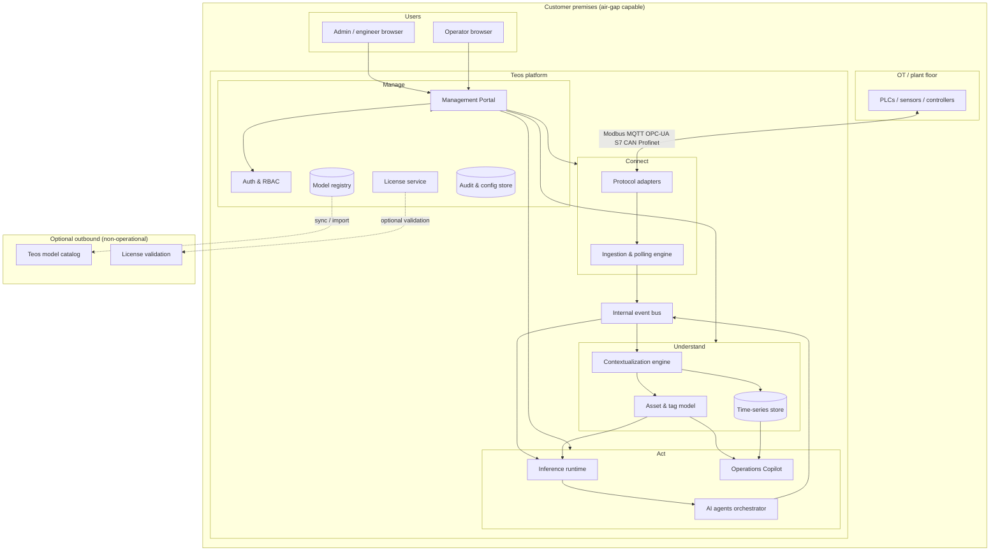
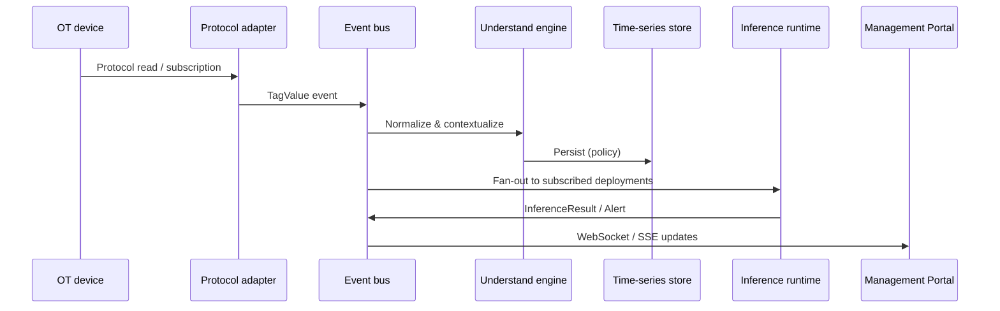
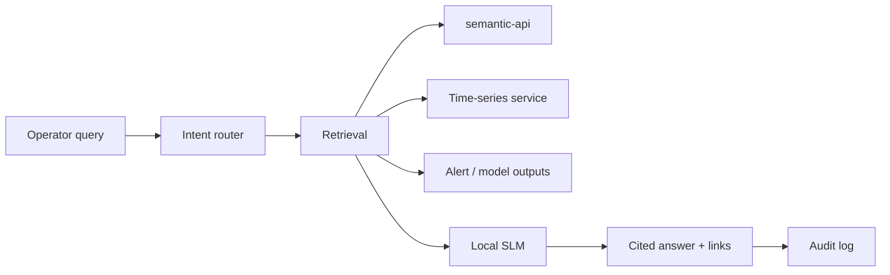

# Software Architecture — Teos Platform

**Status:** Draft for review  
**Audience:** Engineering, product, implementation partners  
**Related:** [business-description.md](./business-description.md), [customer-journey.md](./customer-journey.md)

---

## 1. Executive Summary

Teos is a **sovereign, on-premise-first industrial AI platform** that unifies OT data connectivity, contextualization, AI inference, and operator-facing management in a single deployable system. The architecture is organized around four platform layers — **Connect**, **Understand**, **Act**, and **Manage** — delivered as a set of cooperating services on customer infrastructure with optional outbound connectivity for licensing and model catalog sync only.

**Primary architectural goals:**

| Goal | Implication |
|------|-------------|
| **Sovereignty** | All operational data, inference, and audit logs remain on customer premises; no cloud dependency for runtime |
| **Wire-to-intelligence** | Native multi-protocol ingestion through deployed AI agents without external middleware |
| **Sub-second operations** | Event-driven pipelines, local inference, and edge-optimized storage for &lt;10ms critical paths |
| **Operator-first UX** | Management Portal and Operations Copilot designed for OT personas, not cloud engineers |
| **Vendor neutrality** | Protocol adapters and asset models decoupled from PLC vendor ecosystems |
| **Deployable at SME scale** | Single-node install path; scales to multi-site enterprise without architectural fork |

---

## 2. Architectural Principles

1. **On-prem by default** — Every runtime capability works air-gapped; online features are additive, not required.
2. **Layered separation with shared context** — Connect, Understand, Act, and Manage are logically distinct but share a canonical asset and tag model.
3. **Event-driven core** — Live OT data flows as streams; batch and historical workloads are projections of the same stream.
4. **Pluggable protocols, unified semantics** — Each OT protocol adapter normalizes to a common tag/event schema before contextualization.
5. **Local-first AI registry** — Models are artifacts in an on-prem registry; catalog sync is a distribution channel, not a runtime dependency.
6. **Human-in-the-loop for control** — Autonomous actions are policy-gated; recommendations and alerts are the default deployment mode.
7. **Observable and supportable** — Health endpoints, diagnostics export, and structured audit logs are first-class product features.
8. **Progressive complexity** — SME single-node and enterprise multi-site share one codebase; complexity is enabled via configuration, not separate products.

---

## 3. High-Level System Architecture



### 3.1 Layer Responsibilities

| Layer | Responsibility | Primary consumers |
|-------|----------------|-------------------|
| **Connect** | Protocol connectivity, discovery, polling/subscription, tag normalization | Understand, Act (live inputs) |
| **Understand** | Asset hierarchy, relationships, units, normal ranges, AI-ready semantic model | Act, Copilot, Portal |
| **Act** | Model inference, agent orchestration, alerts, recommendations, closed-loop control (gated) | Portal, Copilot, external CMMS (optional) |
| **Manage** | Portal UI/API, users, licensing, model registry, deployment lifecycle, diagnostics | All human roles |

---

## 4. Core Services

### 4.1 Service Map

| Service | Layer | Description |
|---------|-------|-------------|
| **connect-gateway** | Connect | Central entry for protocol adapter plugins; connection lifecycle, health, rate limits |
| **protocol-adapters** | Connect | Modbus, MQTT, OPC-UA, S7, Profinet, CAN bus, etc. — each as isolated worker/module |
| **tag-normalizer** | Connect | Maps raw protocol reads to canonical `TagValue` events |
| **understand-engine** | Understand | Builds and maintains asset tree, tag bindings, inferred relationships |
| **timeseries-service** | Understand | Local retention, downsampling, recent-history queries for inference and Copilot |
| **semantic-api** | Understand | Query API over assets, tags, relationships, and aggregated views |
| **inference-runtime** | Act | Loads models from registry, runs inference on schedule or events |
| **agent-orchestrator** | Act | Composes multi-step agent workflows (monitor → reason → alert/act) |
| **alert-engine** | Act | Threshold rules, model outputs → alerts, acknowledgements, escalation |
| **copilot-service** | Act | NL query routing, retrieval over Understand + Act outputs, local SLM inference |
| **portal-api** | Manage | BFF/API for Management Portal |
| **portal-ui** | Manage | Web application (dashboard, Connect, models, runtime, Copilot) |
| **auth-service** | Manage | Local users; optional LDAP/SSO connector for enterprise |
| **license-service** | Manage | Entitlements, node/site limits, use-case flags; offline license files |
| **model-registry** | Manage | Encrypted artifact store, signatures, versions, import/export (`.teosmodel`) |
| **catalog-sync** | Manage | Optional pull of catalog metadata and model bundles |
| **audit-service** | Manage | Immutable local audit log (auth, config, copilot queries, control actions) |
| **health-service** | Manage | Aggregated health, installer validation, diagnostics bundle export |
| **installer** | Manage | Bootstrap, dependency check, service orchestration, minimum-spec validator |

### 4.2 Internal Communication

| Pattern | Use |
|---------|-----|
| **Event bus** (NATS, Redis Streams, or embedded) | Live tag values, connection state changes, inference outputs, alerts |
| **gRPC / REST** | Portal ↔ services, synchronous configuration and queries |
| **Shared metadata DB** | PostgreSQL or SQLite (single-node) for config, assets, users, deployments |
| **Blob store** | Model weights, diagnostics bundles, offline install packages |

**Design choice:** Prefer an embedded event bus for SME single-node (fewer moving parts); allow external bus for scaled enterprise topologies.

---

## 5. Data Architecture

### 5.1 Canonical Data Model

```
Site
 └── Area / Line
      └── Asset (machine, pump, extruder, ...)
           └── Tag (signal)
                └── TagValue { timestamp, value, quality, unit }
```

**Key entities:**

| Entity | Purpose |
|--------|---------|
| `Connection` | Protocol endpoint config, credentials, poll/subscribe mode, health |
| `Tag` | Normalized signal: ID, name, data type, unit, source mapping |
| `Asset` | Physical/logical equipment node in hierarchy |
| `TagBinding` | Tag ↔ asset association with optional role (e.g. vibration, temperature) |
| `ModelArtifact` | Versioned binary + manifest (inputs, hardware reqs, signature) |
| `Deployment` | Running model/agent instance: scope, bindings, runtime config, mode |
| `Alert` | Generated event with asset link, severity, acknowledgement state |
| `AuditEntry` | Who did what, when — config, queries, control attempts |

### 5.2 Storage Tiers (all on-prem)

| Tier | Technology direction | Retention | Workloads |
|------|---------------------|-----------|-----------|
| **Hot stream** | In-memory ring buffer + event bus | Seconds–minutes | Real-time inference, live preview |
| **Warm time-series** | TimescaleDB, InfluxDB, or QuestDB | Days–months (configurable) | Copilot queries, charts, model warm-up |
| **Cold archive** | Compressed files on disk | Years (optional) | Compliance, post-incident analysis |
| **Config & metadata** | PostgreSQL / SQLite | Indefinite | Portal, assets, users, deployments |
| **Model artifacts** | Encrypted filesystem / object store | Per license | Registry, version rollback |

**Sovereignty rule:** No operational tier replicates outside customer premises. Backup is customer-controlled.

### 5.3 Data Flow (live path)



---

## 6. Connect Layer — Detailed Design

### 6.1 Protocol Adapter Framework

Each adapter implements a common interface:

```
AdapterPlugin {
  discover(config) → TagDescriptor[]
  connect(config) → ConnectionHandle
  read(handle, tags) → TagValue[]
  subscribe(handle, tags, callback) → Subscription
  health(handle) → HealthStatus
}
```

| Concern | Approach |
|---------|----------|
| **Isolation** | Adapters run as separate processes/containers to contain protocol crashes |
| **Vendor templates** | Pre-built mapping profiles (Siemens, Allen-Bradley, ABB, etc.) as config overlays |
| **Security** | OPC-UA certs, credential vault, read-only default for connections |
| **Discovery** | OPC-UA browse, Modbus register scan, MQTT topic introspection |
| **Backpressure** | Per-connection rate limits; drop/low-priority policies under load |

### 6.2 Connection Lifecycle

```
Draft → Testing → Active → Paused → Error → Archived
```

Portal guides: configure → test preview → map tags → assign assets → activate streaming.

---

## 7. Understand Layer — Detailed Design

### 7.1 Contextualization Pipeline

1. **Ingest** normalized tags from Connect.
2. **Classify** signals (analog, digital, counter, string) and infer units where possible.
3. **Bind** tags to assets via templates, rules, or engineer overrides.
4. **Learn baselines** — rolling statistics for normal ranges (feeds anomaly models).
5. **Expose** semantic graph via `semantic-api` for Act and Copilot.

### 7.2 AI-Ready Representation

The Understand layer produces a **plant graph** consumable by:

- Model input validators (type, unit, history depth)
- Copilot retrieval (asset-scoped queries)
- Portal asset views (hierarchy navigation)

**Not a full digital twin** in v1 — focus on operational semantics sufficient for AI binding and operator comprehension. Expand toward richer twin features in later phases.

---

## 8. Act Layer — Detailed Design

### 8.1 Inference Runtime

| Capability | Design |
|------------|--------|
| **Scheduling** | Fixed interval, event-driven (tag change), or hybrid |
| **Hardware** | CPU default; GPU/NPU detection at install; per-deployment resource profiles |
| **Isolation** | One worker process per deployment (or shared pool with cgroup limits) |
| **Modes** | Shadow (alerts only), recommend, closed-loop (policy + HITL) |
| **Latency** | Critical paths bypass Portal; direct bus → runtime for &lt;10ms targets |

### 8.2 Agent Orchestrator

Agents are **declarative workflows** over:

- Live tag subscriptions
- Model inference steps
- Rules and thresholds
- Optional external actions (webhook to CMMS — enterprise)

Example agent types: predictive maintenance, anomaly detection, quality optimization, energy optimization, autonomous process control.

### 8.3 Operations Copilot



| Control | Implementation |
|---------|----------------|
| RBAC | Asset-scoped retrieval; operators see entitled subtree only |
| Grounding | Answers must cite tag IDs, timestamps, asset IDs |
| Safety | No control actions without explicit role + policy; escalate on ambiguity |
| Feedback | Thumbs up/down stored locally for engineer tuning loop |

---

## 9. Manage Layer — Management Portal

### 9.1 Portal Architecture

| Tier | Stack direction |
|------|-----------------|
| **Frontend** | React or similar SPA; served statically by portal-api |
| **API** | portal-api as BFF aggregating backend services |
| **Real-time** | WebSocket/SSE from event bus for live tags, alerts, runtime status |

### 9.2 Information Architecture (maps to customer journey)

| Area | Backend services |
|------|------------------|
| **Home / Dashboard** | health-service, onboarding state, alert summary |
| **Connect** | connect-gateway, understand-engine (preview) |
| **AI Models → Catalog** | catalog-sync, model-registry |
| **AI Models → Installed** | model-registry |
| **Deploy & Runtime** | inference-runtime, agent-orchestrator, alert-engine |
| **Copilot** | copilot-service |
| **Settings** | auth-service, license-service, site config |
| **Help** | diagnostics export via health-service |

### 9.3 First-Run Wizard

Orchestrated by portal-api with persisted checklist state:

1. Site metadata (name, timezone, language)
2. License activation
3. User creation
4. Guided next steps → Connect → Catalog → Deploy → Copilot

---

## 10. Deployment Architecture

### 10.1 Deployment Topologies

| Topology | Target | Composition |
|----------|--------|-------------|
| **Single-node (SME)** | 1 edge server / industrial PC | All services in one compose/k8s namespace; SQLite acceptable |
| **Split compute** | GPU inference separate from Connect | Connect + Understand on edge; Act on GPU node; same event bus |
| **Enterprise multi-site** | Central governance, site autonomy | Per-site Teos instance; optional central catalog/license portal (metadata only) |
| **Appliance** | Pre-imaged hardware | Immutable OS + Teos stack; first-boot wizard |

### 10.2 Packaging

| Form | Contents |
|------|----------|
| **Online installer** | Pull images/packages, optional catalog sync |
| **Offline bundle** | All containers, `.teosmodel` samples, offline license format |
| **OVA / ISO** | Appliance image for VM or bare metal |

### 10.3 Orchestration

- **Default:** Docker Compose for SME and PoC
- **Enterprise option:** Kubernetes (K3s on edge or customer cluster)
- **Installer responsibilities:** HW spec validation, GPU/NPU detection, TLS cert generation, service dependency order, health gate

### 10.4 Network Zones

```
[Operator VLAN] ──HTTPS──► Management Portal
[Engineering VLAN] ──HTTPS──► Management Portal
[OT VLAN] ◄──protocols──► Connect adapters (no inbound from internet)
[DMZ optional] ──► outbound license/catalog only (if not air-gapped)
```

---

## 11. Security & Sovereignty

| Domain | Design |
|--------|--------|
| **Authentication** | Local accounts (default); LDAP/SSO plugin for enterprise |
| **Authorization** | RBAC: Admin, Engineer, Operator — asset-scoped for Operator |
| **Secrets** | Vault or encrypted local keystore for OPC-UA certs, PLC credentials |
| **Model integrity** | Signed `.teosmodel` bundles; checksum on import |
| **Audit** | Append-only local audit log; export for support |
| **Network** | No inbound from public internet required; egress disabled in air-gap mode |
| **Data residency** | Operational data never leaves premises; catalog sync downloads artifacts inward only |
| **Control actions** | Policy engine: role check, HITL approval, rate limits, rollback |

---

## 12. Licensing & Model Catalog

### 12.1 Entitlements Model

```
License {
  site_id, tier,
  max_nodes / max_tags,
  use_cases: [predictive_maintenance, copilot, ...],
  expiry, signature
}
```

Enforced at: connection activation, model deploy, copilot enable.

### 12.2 Catalog Sync vs. Air-Gap

| Mode | Flow |
|------|------|
| **Connected** | catalog-sync pulls metadata + artifacts into model-registry |
| **Air-gapped** | USB / file import of `.teosmodel` + offline license file |
| **Enterprise** | Change-approval workflow before new versions go to Installed |

### 12.3 Model Artifact Format (`.teosmodel`)

- Signed manifest (inputs, outputs, hardware, version, use case)
- Weight files (encrypted at rest in registry)
- Optional runtime container reference

---

## 13. Integration Points (Enterprise)

| Integration | Direction | Data |
|-------------|-----------|------|
| **LDAP / SSO** | Inbound auth | User/group sync |
| **CMMS** | Outbound webhooks | Alerts, work orders |
| **SCADA/HMI** | Read-only export | Tag values, alerts via OPC-UA server or MQTT mirror |
| **SIEM** | Outbound syslog | Audit and security events |
| **Backup** | Customer tooling | VM snapshot, DB backup — not Teos-managed cloud backup |

All integrations optional; SME path works with zero external systems.

---

## 14. Observability & Support

| Signal | Mechanism |
|--------|-----------|
| **Service health** | `/health` per service; aggregated dashboard |
| **Connection health** | Per-connection status, last successful read, error codes |
| **Runtime metrics** | Inference latency, throughput, GPU utilization |
| **Diagnostics bundle** | Zip of logs, config redacted secrets, versions — export from Portal |
| **Install log** | Archived by installer for Phase 1 support |

---

## 15. Technology Recommendations (Initial)

These are directional choices to accelerate MVP; final selection should follow team expertise and edge hardware targets.

| Concern | Recommendation | Rationale |
|---------|----------------|-----------|
| **Backend language** | Go or Rust for Connect/runtime; Python for ML tooling | Performance + OT protocol ecosystems |
| **Portal** | TypeScript (React) + Go/Node API | Operator UX velocity |
| **Event bus** | NATS or Redis Streams | Lightweight, embeddable, high throughput |
| **Metadata DB** | PostgreSQL (prod); SQLite (single-node) | Mature, edge-viable |
| **Time-series** | TimescaleDB or QuestDB | SQL familiarity, compression |
| **ML serving** | ONNX Runtime / TensorRT; Ollama or llama.cpp for SLM | On-prem, hardware-accelerated |
| **Packaging** | Docker + Compose; Helm for K8s | Matches installer/appliance story |
| **Auth** | OIDC-ready library + LDAP connector | Enterprise SSO path |

---

## 16. API Surface (Conceptual)

### 16.1 External APIs (Portal / integrations)

| API group | Examples |
|-----------|----------|
| **Connect** | `POST /connections`, `GET /connections/{id}/preview`, `POST /connections/{id}/activate` |
| **Assets** | `GET /assets/tree`, `PATCH /assets/{id}`, `POST /tags/bind` |
| **Models** | `GET /models/catalog`, `POST /models/import`, `POST /deployments` |
| **Runtime** | `GET /deployments/{id}/status`, `POST /deployments/{id}/restart` |
| **Alerts** | `GET /alerts`, `POST /alerts/{id}/ack` |
| **Copilot** | `POST /copilot/chat` (streaming) |
| **Admin** | `POST /users`, `GET /license`, `GET /health`, `POST /diagnostics/export` |

### 16.2 Internal Contracts

- `TagValue`, `InferenceResult`, `AlertEvent` — protobuf or JSON schema on event bus
- Versioned adapter plugin SDK for third-party protocol extensions

---

## 17. Non-Functional Requirements

| NFR | Target |
|-----|--------|
| **Inference latency (edge-critical)** | &lt;10ms p99 on configured paths |
| **Tag ingest throughput** | 10k–100k tags/sec (topology-dependent) |
| **Portal responsiveness** | &lt;200ms for config APIs |
| **Availability** | 99.9% single-node with supervised restarts |
| **Install time (SME)** | &lt;4 hours including first healthy connection |
| **Air-gap** | Full journey Phases 1–6 without internet |
| **Upgrade** | Rolling model version rollback without reconnecting OT |

---

## 18. Phased Implementation Roadmap

### Phase A — Platform skeleton (MVP)

- Installer + health-service + single-node Compose
- Management Portal: onboarding wizard, settings, health dashboard
- auth-service (local users), license-service (offline license)
- connect-gateway + 2 adapters (Modbus TCP, MQTT)
- understand-engine: manual asset tree + tag binding
- timeseries-service: warm store, live preview
- model-registry + manual `.teosmodel` import
- inference-runtime: one model type (anomaly detection)
- alert-engine + Portal runtime view

**Journey coverage:** Phases 1–5 for pilot use case on one line.

### Phase B — Operator experience

- Operations Copilot (local SLM + retrieval)
- Additional adapters (OPC-UA, S7)
- Auto-discovery and vendor templates
- catalog-sync (online mode)
- Shadow vs. active deployment modes
- Diagnostics bundle export

**Journey coverage:** Full Phase 6; SME time-to-value in days.

### Phase C — Enterprise hardening

- LDAP/SSO, asset-scoped RBAC refinements
- Multi-site license model
- CMMS / SCADA integration hooks
- GPU/NPU resource profiles
- Agent orchestrator for multi-step workflows
- Kubernetes Helm chart, appliance image

### Phase D — Advanced AI

- On-prem fine-tuning pipeline (optional)
- Closed-loop control with HITL governance UI
- Custom model upload and validation
- Baseline learning and drift detection in Understand

---

## 19. Key Architecture Decisions (ADRs to formalize)

| # | Decision | Options | Recommendation |
|---|----------|---------|----------------|
| ADR-1 | Single vs. multi-repo | Monorepo vs. polyrepo | Monorepo with `/services`, `/adapters`, `/portal` |
| ADR-2 | Event bus | NATS, Redis, Kafka, embedded | NATS for edge; embedded fallback for tiny installs |
| ADR-3 | Metadata DB per node | PostgreSQL vs. SQLite | SQLite &lt; N tags; PostgreSQL otherwise |
| ADR-4 | Copilot SLM | Ollama, llama.cpp, custom | llama.cpp + quantized models for air-gap size |
| ADR-5 | Control actions | Direct PLC write vs. recommend-only | Recommend-only default; write behind policy gate |
| ADR-6 | Multi-site | Federated instances vs. central cluster | Federated per-site; no operational centralization |

---

## 20. Risks & Mitigations

| Risk | Mitigation |
|------|------------|
| Protocol long tail | Plugin SDK + partner-built adapters |
| Edge hardware variance | Minimum spec validator; CPU fallback paths |
| Model false positives erode trust | Shadow mode default; tuning UX; version rollback |
| Air-gap catalog staleness | Offline bundle cadence; USB workflow in Portal |
| SME vs. enterprise divergence | One platform, feature flags and topology profiles |
| Copilot hallucination | Retrieval-grounded answers; mandatory citations; escalate on low confidence |

---

## 21. Open Questions (Architecture Impact)

From business and journey docs — unresolved items that will refine this architecture:

| Question | Architectural fork |
|----------|-------------------|
| Software-only vs. appliance | Image pipeline, hardware abstraction layer |
| Pre-built vs. customer-trained models | Training pipeline, GPU requirements, data labeling UX |
| Open-source core vs. proprietary | Repo structure, adapter SDK licensing |
| First vertical (oil & gas vs. discrete mfg) | Adapter priority, model catalog ordering |
| Outcome-based pricing | Telemetry for value attribution (still on-prem, customer-exported) |

---

## 22. Summary

Teos architecture delivers **one sovereign platform** on customer infrastructure by composing protocol adapters, a shared semantic model, local AI runtime, and an operator-centric Management Portal. The four layers — Connect, Understand, Act, Manage — map directly to the customer journey from install through Operations Copilot. The system is designed to **install as a single node**, run **air-gapped**, and **scale out** via split compute and federated multi-site deployments without changing the core abstractions.

**Next recommended documents:**

- [ ] Management Portal IA and API OpenAPI spec
- [ ] Protocol adapter plugin SDK specification
- [ ] `.teosmodel` bundle format and signing protocol
- [ ] Operations Copilot safety and prompt specification
- [ ] Installer and appliance build pipeline design
